# アーキテクチャ

## 構成図

## Frontend

- Octavio
  - 競技者用ダッシュボード
- Duardo
  - 運営用ダッシュボード

## BFF (Backend for Frontend)

- Ajay
  - 競技者用ダッシュボードのBFF
- Torres
  - 運営用ダッシュボードのBFF

## Backend

- Jackson
  - 競技者用セッションマネージャー
- Ashleigh
  - 運営用セッションマネージャー
- Anita
  - ユーザー / チーム管理サービス
- Kaleb
  - 再展開サービス
- Natalie
  - 問題管理サービス
- TJP
  - 問題同期サービス
- Mary
  - 回答管理サービス
- Loba
  - スコア / 順位管理サービス
- Kairi
  - プライベートチャットサービス
- Obi
  - 全体連絡サービス
- Pathfinder
  - 通知サービス
