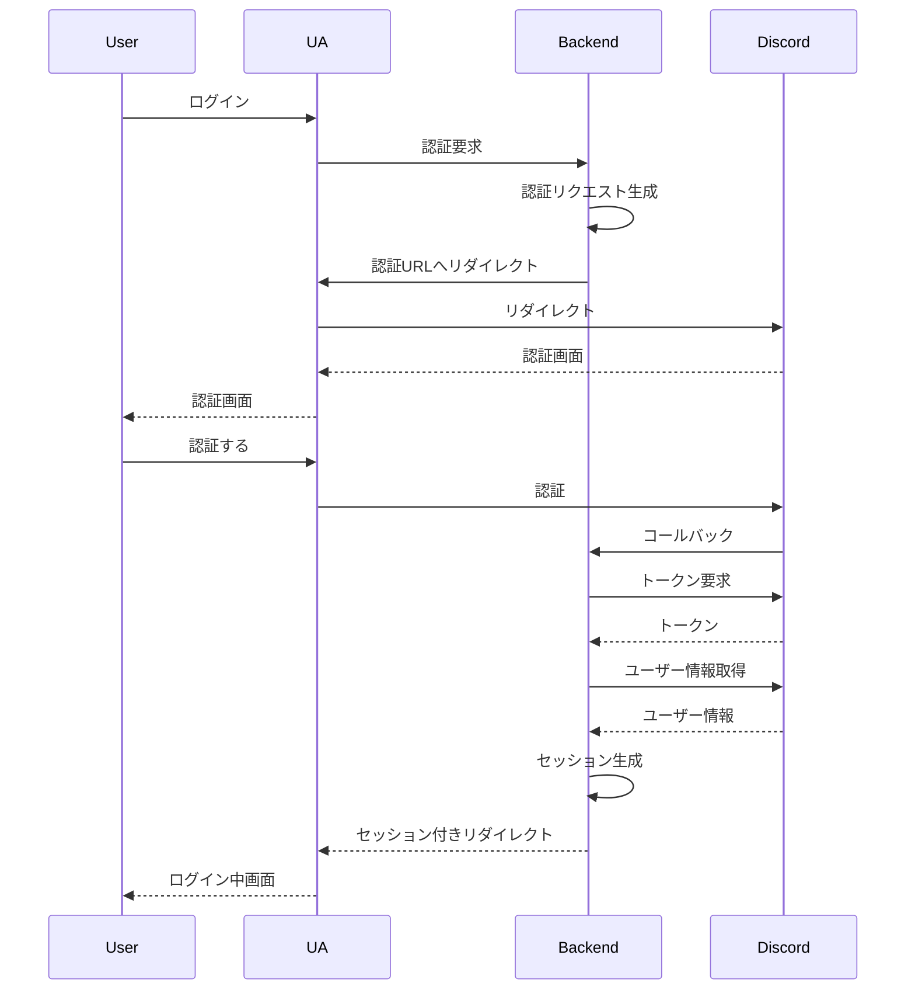

# サインインフロー

最長のフローは以下．いわゆる OAuth2 Code Flow になっている

## 認証リクエスト

エンドポイント `GET /api/auth/discord`

フロントエンドからはこのエンドポイントにナビゲーションする形になる

### クエリ
- (optional) `next_url` 認証完了時に遷移するパスを指定する．デフォルトは`/`

### 振舞い

1. 既にセッションが存在するなら`next_url`にリダイレクトして終了
2. セッションが存在しない or セッション切れであるならば認証リクエストを作成して DB に保存し，認証 URL に認証中状態を表すセッション Cookie を付与してリダイレクトする

### 懸念点

認証なしでリクエストでき多くのパターンで DB への書き込みを伴う．
これにより DoS に脆弱になることが考えられるのでレートリミットなどを検討したい．

## 認証コールバック

エンドポイント `GET /api/auth/discord/callback`

### 振舞い

1. セッション Cookie と OAuth2 Code Flow のコールバックとしてのパラメータを検証する
2. トークンやDiscord上ユーザ情報などの情報を取得してユーザとの紐付けをする
3. 紐付けをもとにしてセッションを生成して`next_url`にリダイレクトする
