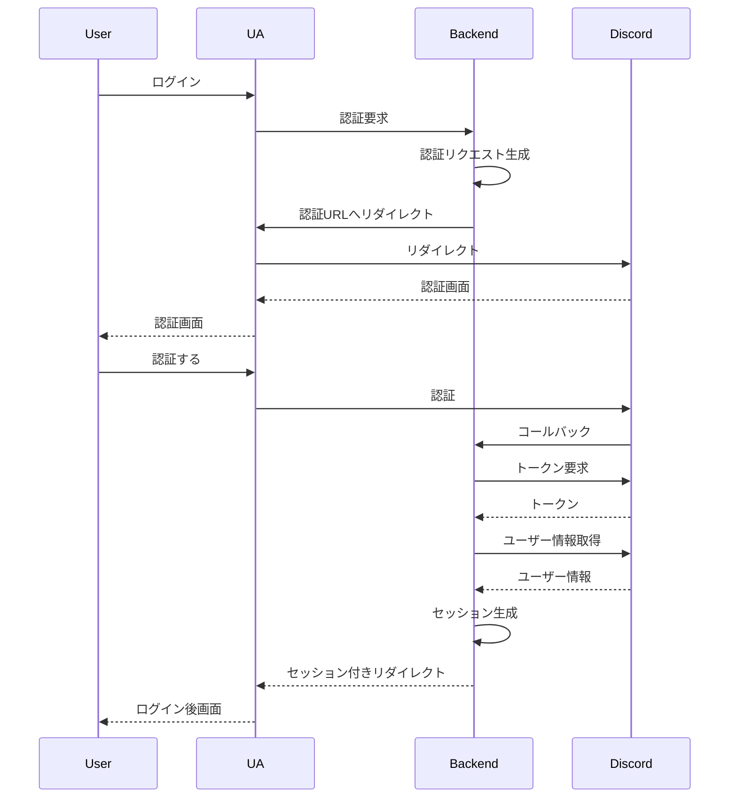

# 競技者サインインフロー

Discord Authorization Code FlowとPKCEを使用する。OAuth stateとPKCE verifierは
10分で失効するopaque sessionとしてRedisへ保存する。

```mermaid
sequenceDiagram
    User->>UA: ログイン
    UA->>Backend: 認証要求
    Backend->>Backend: 認証リクエスト生成
    Backend->>UA: 認証URLへリダイレクト
    UA->>Discord: リダイレクト
    Discord-->>UA: 認証画面
    UA-->>User: 認証画面
    User->>UA: 認証する
    UA->>Discord: 認証
    Discord->>Backend: コールバック
    Backend->>Discord: トークン要求
    Discord-->>Backend: トークン
    Backend->>Discord: ユーザー情報取得
    Discord-->>Backend: ユーザー情報
    Backend->>Backend: セッション生成
    Backend-->>UA: セッション付きリダイレクト
    UA-->>User: ログイン後画面
```

## 認証リクエスト

エンドポイント `GET /api/v1/auth/discord`

フロントエンドからはこのエンドポイントにナビゲーションする形になる

### クエリ

- (optional) `next` 認証完了時に遷移する同一origin内のpathを指定する。デフォルトは`/`

### 振舞い

1. state、PKCE verifier/challenge、遷移先を生成する。
2. OAuth状態を`oauth2-session` Cookieへ対応付け、Discordへ302で遷移する。
3. Discordから戻るcross-site navigationで必要なため、このCookieはHttpOnlyかつSameSite=Laxとする。

## 認証コールバック

エンドポイント `GET /api/v1/auth/discord/callback`

### 振舞い

1. state、短期Cookie、callback parameterを検証する。
2. PKCE verifier付きでcodeを交換し、`identify` scopeでDiscord identityを取得する。
3. 登録済みなら3日間の`user-session`、未登録なら10分間の`signup-session`を発行する。
4. 一時OAuth Cookieを消去し、保存した`next`へ302で戻す。利用sessionはHttpOnlyかつSameSite=Strictとする。

Adminは`/api/v1/admin/auth/discord`以下の同等フローを使い、
`guilds.members.read`でguild membershipと許可roleを確認して8時間の
`admin-session`を発行する。
